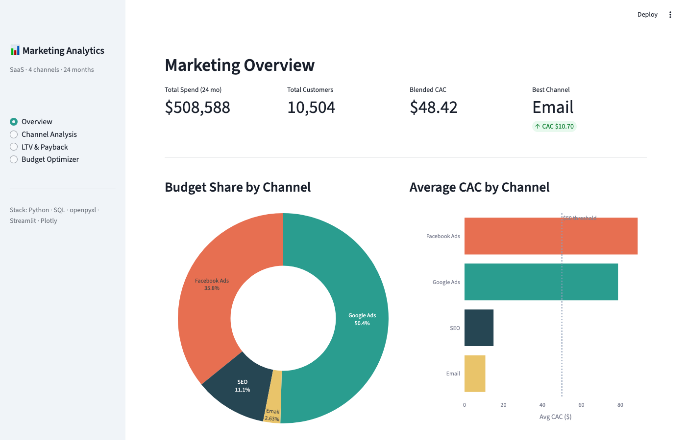

# Marketing Attribution & Unit Economics

Portfolio data analytics project analyzing marketing channel performance across 4 channels

 — Google Ads, Facebook Ads, SEO, Email — with CAC/LTV/ROAS metrics, cohort LTV modeling, and an interactive budget optimizer.

## Business Problem

A SaaS company spends $16 500/month across 4 marketing channels but doesn't know which ones are actually worth the investment. This project answers:

- Which channel has the lowest CAC and highest LTV?
- When does each channel pay back its acquisition cost?
- How should the budget be reallocated to maximise customer growth?

## Key Findings

| Channel | Avg CAC | LTV | LTV/CAC | Payback |
| --- | ---: | ---: | ---: | ---: |
| Email | $10.7 | $1 136 | 106x | 0.3 mo |
| SEO | $14.9 | $1 100 | 74x | 0.4 mo |
| Google Ads | $78.8 | $628 | 8x | 1.5 mo |
| Facebook Ads | $88.9 | $333 | 3.7x | 2.9 mo |

**Recommendation:** Cut Facebook Ads by 50%, double SEO investment. Expected 12-month incremental GP: +$18 000–$40 000.

## Live Dashboard

```bash
python3 -m venv .venv && source .venv/bin/activate
pip install -r requirements.txt
streamlit run app.py
```

## Repository Structure

```text
.
├── app.py                              # Streamlit dashboard (4 pages + budget optimizer)
├── unit_economics_model.xlsx           # Excel model: Inputs · Unit Economics · Scenarios
├── data/
│   ├── marketing_spend.csv             # Monthly spend, clicks, impressions per channel
│   ├── customer_acquisitions.csv       # New customers and CAC per channel/month
│   ├── cohort_ltv.csv                  # Cohort survival and revenue (months 0–12)
│   ├── generate_marketing_data.py      # Reproducible synthetic data generator
│   └── create_excel_model.py          # Excel model generator (openpyxl)
├── notebooks/
│   ├── 01_channel_performance.ipynb   # CAC, ROAS, spend trends, efficiency matrix
│   ├── 02_ltv_payback.ipynb           # LTV model, survival curves, payback periods
│   └── 03_budget_optimisation.ipynb   # Budget reallocation + scenario projections
├── sql/
│   ├── 01_cac_by_channel.sql          # CAC metrics, blended CAC, budget share
│   ├── 02_roas_monthly.sql            # Month-0 and 12-month cohort ROAS
│   └── 03_ltv_cohorts.sql             # Cohort retention, cumulative LTV, payback
├── images/                             # Exported charts
└── .streamlit/config.toml
```

## Skills Demonstrated

- Marketing channel attribution (CAC, LTV, ROAS, Payback Period)
- Cohort LTV modeling with survival curves and churn rates
- Excel financial model creation with formulas via openpyxl (3 sheets)
- Interactive budget optimizer with real-time projections (Streamlit sliders)
- Synthetic data generation with seasonal patterns and growth curves
- SQL window functions for cumulative metrics and cohort analysis
- Business recommendation framework with quantified impact
